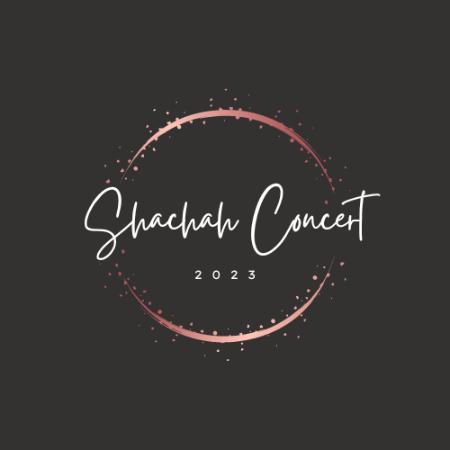

<a name="readme-top"></a>

<div align="center">

  
  <br/>

  <h3><b>Shachah Concert 2023</b></h3>

</div>

<!-- TABLE OF CONTENTS -->

# 📗 Table of Contents

- [📖 About the Project](#about-project)
  - [🛠 Built With](#built-with)
    - [Tech Stack](#tech-stack)
    - [Key Features](#key-features)
  - [🚀 Live Demo](#live-demo)
- [💻 Getting Started](#getting-started)
  - [Setup](#setup)
  - [Prerequisites](#prerequisites)
  - [Install](#install)
  - [Usage](#usage)
  - [Run tests](#run-tests)
  - [Deployment](#triangular_flag_on_post-deployment)
- [👥 Authors](#authors)
- [🔭 Future Features](#future-features)
- [🤝 Contributing](#contributing)
- [⭐️ Show your support](#support)
- [🙏 Acknowledgements](#acknowledgements)
- [❓ FAQ](#faq)
- [📝 License](#license)

<!-- PROJECT DESCRIPTION -->

# 📖 Shachah Concert<a name="about-project"></a>

**Shachah** is one of the interesting projects I have had to work on as a developer. This project is geared towards providing an online awareness about the annual Shachah concert. Shachah concert is a worship concert that is done virtually, to help people irrespective of their location to have an awesome worship experience. It features amazing gospel artists whose worship ministry has produced a global impact over the years.  
## 🛠 Built With <a name="built-with"> Html and CSS</a>

### Tech Stack <a name="tech-stack"></a>

<details>
  <summary>Frontend</summary>
  <ul>
    <li>Html and CSS</li>
  </ul>
</details>

<!-- Features -->

### Key Features <a name="key-features"></a>

- **Social Media Integration**
- **Email Integration**
- **Formspree Integration**

<p align="right">(<a href="#readme-top">back to top</a>)</p>

<!-- LIVE DEMO -->

## 🚀 Live Demo <a name="live-demo"></a>

> Add a link to your deployed project.
- [Live Demo Link](https://ayomoses1.github.io/Shachah/)

<p align="right">(<a href="#readme-top">back to top</a>)</p>

<!-- GETTING STARTED -->

## 💻 Getting Started <a name="getting-started"></a>

> Describe how a new developer could make use of your project.
To get a local copy up and running, follow these steps.

### Prerequisites

In order to run this project you need:


```sh
 npm install node
```


### Setup

Clone this repository to your desired folder:


```sh
  cd your-folder
  git clone https://github.com/AyoMoses1/Shachah.git
```

### Install

Install this project with:


```sh
  cd my-project
  node version 16
```


### Usage

To run the project, execute the following command:

<!--
Example command:
```sh
  rails server
```
--->

### Run tests

To run tests, run the following command:

<!--
Example command:
```sh
  bin/rails test test/models/article_test.rb
```
--->

### Deployment

You can deploy this project using:

- GitHub Pages
- Netlify
- Heroku
- Cyclic


<p align="right">(<a href="#readme-top">back to top</a>)</p>

<!-- AUTHORS -->

## 👥 Authors <a name="authors"></a>

👤 **Author**

- GitHub: [@AyoMoses1](https://github.com/AyoMoses1)
- Twitter: [@Ayo_Moses1](https://twitter.com/Ayo_Moses1)
- LinkedIn: [Ayo Moses](https://www.linkedin.com/in/ayo-moses-493946184/)


<p align="right">(<a href="#readme-top">back to top</a>)</p>

<!-- FUTURE FEATURES -->

## 🔭 Future Features <a name="future-features"></a>

- **Responsive Application**
- **Email Integration**
- **Github Deployment**

<p align="right">(<a href="#readme-top">back to top</a>)</p>

<!-- CONTRIBUTING -->

## 🤝 Contributing <a name="contributing"></a>

Contributions, issues, and feature requests are welcome!

Feel free to check the [issues page](../../issues/).

<p align="right">(<a href="#readme-top">back to top</a>)</p>

<!-- SUPPORT -->

## ⭐️ Show your support <a name="support"></a>

If you like this project, please support by contributing to the codebase

<p align="right">(<a href="#readme-top">back to top</a>)</p>

<!-- ACKNOWLEDGEMENTS -->

## 🙏 Acknowledgments <a name="acknowledgements"></a>

I would like to thank Cindy Shin for the awesome and inspiring design idea of this project. The design guidelines for this project was gotten from one of her most profound designs for a conference. Please find here a link to the <a href="https://creativecommons.org/licenses/by-nc/4.0/legalcode">license</a>, <a href="https://creativecommons.org/licenses/by-nc/4.0/#">disclaimer</a> and a link to the original <a href="https://www.behance.net/gallery/29845175/CC-Global-Summit-2015">design</a>

<p align="right">(<a href="#readme-top">back to top</a>)</p>

<!-- FAQ (optional) -->

## ❓ FAQ <a name="faq"></a>

> Add at least 2 questions new developers would ask when they decide to use your project.
- **Will there be a desktop version of this project**

  - Yes, there will certainly be a desktop version to aid desktop users in having a friendly UX experience on the website


<p align="right">(<a href="#readme-top">back to top</a>)</p>

<!-- LICENSE -->

## 📝 License <a name="license"></a>

This project is [MIT](./LICENSE.md) licensed.


<p align="right">(<a href="#readme-top">back to top</a>)</p>